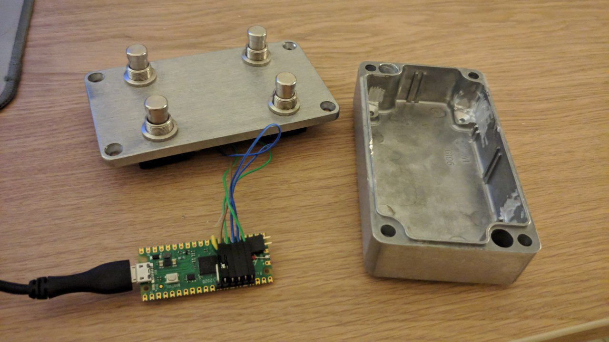

## Stompi

A MIDI pedalbox using Raspi pico (or just about any circuitpy board, probably)

In my build, four buttons are connected to GP10, GP11, GP12, GP13, connecting each to GND.



You can connect as many buttons as you wish, just make sure they are momentary (i.e. they release themselves whenever they are not pushed).

## Installing
Install CircuitPython 9.x (tested with 9.2.3) on a raspi pico (with or without W)

Copy `code.py` and `boot.py` and `lib/` to your board and reset it

Copy one of the configuration files from `examples/` as `/stompi.json` on the board and edit
to your desired set of actions

## Usage

Plug in, start pressing the buttons!


## What the buttons do

A configuration file contains a set of button definitions.


### Button modes
Each button has an "action" set to either `"single"` or `"double"`.

A "single" button always performs the same action, a press and release that you control.

A "double" button will perform one action for a short press (a tap) and a different action for a long press (a hold).


### Button actions
All buttons have a `"short"` action (what happens on a tap). `"double"` buttons also have a `"long"` action configured (what happens when the button is held)

If the configuration is  for "midi", the following action configurations are possible:

```
A MIDI "Control Change" event for channel 42:
{ "cc": 42 }

A MIDI "Note" event for channel 67:
{ "note": 67 }
```

If the configuration is for "hid", the following action configurations are possible:

```
Mouse button to press/release
{ "click": 0 }

Name of a keyboard key to press/release
If you put a capital letter, you'll get Shift too!
{ "key": "f" }

A string of text to type. This does nothing on release.
Note that this will suffer from some keyboard layout weirdness.
{ "text": "Hey hey, let's go!" }

Numeric keycode (ask your parents) to press/release
Reference:
https://docs.circuitpython.org/projects/hid/en/latest/api.html#adafruit_hid.keycode.Keycode
{ "keycode": 230 }
```

### TODO: Future development:
- Other key modifiers
- Mouse scroll events
- Can you do MIDI and HID at the same time? I don't think so, but it would be great
